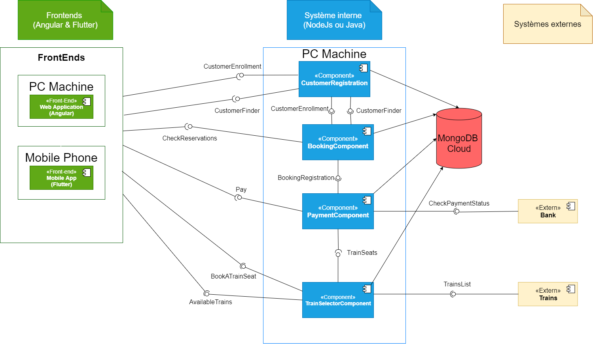
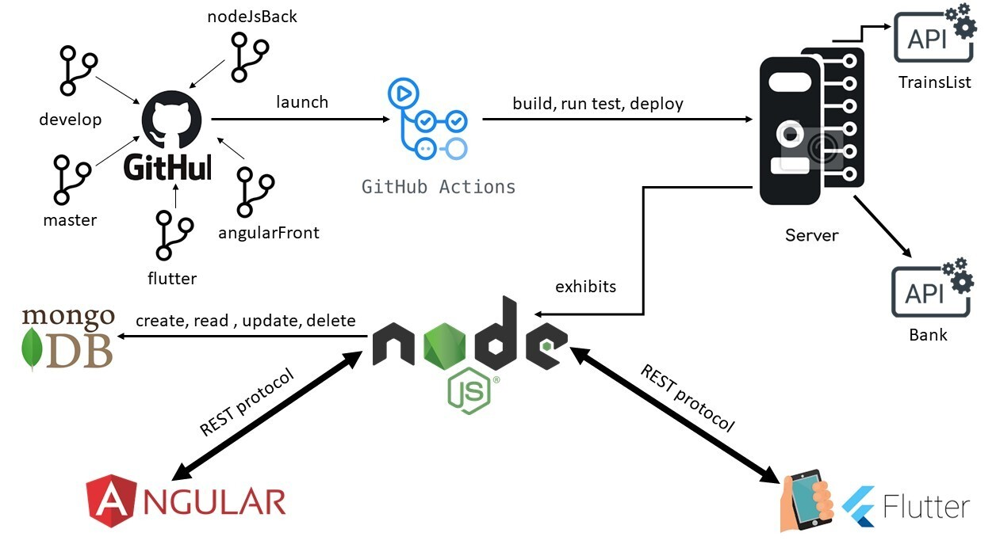
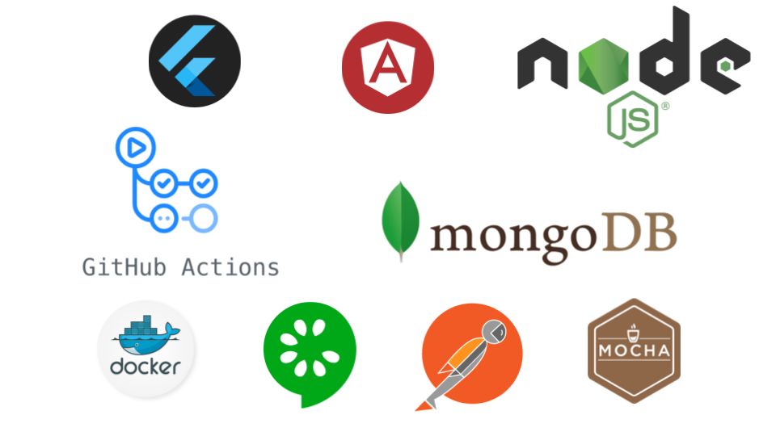

# train-booking-al-20-21
* Auteurs: **Team C**
    * AINADOU Florian
    * DJEKINOU Paul-Marie
    * KOFFI Paul
    * NABAGOU Djotiham
* Version actuelle: POC
* Livrables:
    * [POC](https://github.com/wak-nda/train-booking-al-20-21-team-c/releases/tag/tag_46)
* Tags: 
    * **Year 2021**
        * [Week 8](https://github.com/wak-nda/train-booking-al-20-21-team-c/releases/tag/tag_8)
        * [Week 7](https://github.com/wak-nda/train-booking-al-20-21-team-c/releases/tag/tag_7)
        * [Week 6](https://github.com/wak-nda/train-booking-al-20-21-team-c/releases/tag/tag_6)
        * [Week 5](https://github.com/wak-nda/train-booking-al-20-21-team-c/releases/tag/tag_5)
        * [Week 4](https://github.com/wak-nda/train-booking-al-20-21-team-c/releases/tag/tag_4)
    * **Year 2020**
        * [Week 46 (POC)](https://github.com/wak-nda/train-booking-al-20-21-team-c/releases/tag/tag_46)
        * Week 45 : [No tag] Semaine de démo
        * [Week 44](https://github.com/wak-nda/train-booking-al-20-21-team-c/releases/tag/tag_44)
        * [Week 43](https://github.com/wak-nda/train-booking-al-20-21-team-c/releases/tag/tag_43)
        * [Week 42](https://github.com/wak-nda/train-booking-al-20-21-team-c/releases/tag/tag_42)
        * [Week 41](https://github.com/wak-nda/train-booking-al-20-21-team-c/releases/tag/tag_41)
        * [Week 40](https://github.com/wak-nda/train-booking-al-20-21-team-c/releases/tag/tag_40)
* Statuts d'Intégration continue sur Master: 
    * [backend](./backend) : 
  
# Vue d'ensemble
 Cette étude de cas est utilisée pour illustrer les différentes technologies impliquées dans le cours d'Architecture Logicielle donné à Polytech Nice - Sophia Antipolis en 5e année
   
  ## Vision du produit
  Train booking est un système de réservation de billets de train ayant pour objectif de fournir aux utilisateurs un moyen dématérialisé d'effectuer leurs réservations.
  Du point de vue fonctionnel, cette application disponible sur deux interfaces mobile et web devra permettre au client d'effectuer le minimum d'actions nécessaires de nos jours pour réserver un billet de train (en se référant aux applications existantes sur le marché).
  Du point de vu architecture, technique, analyse, organisation et maintenabilité du système à implémenter, ce projet a pour objectif de mettre en application les bonnes pratiques architecturaux vus en cours en parallèle d'un bon niveau de complexité.
  
  La présentation (soutenance) du POC se trouve 👉 [ici](./deliverables/soutenance_1.pdf).
  
  Le document d'architecture du projet se trouve 👉 [ici](./deliverables/architecture.pdf).
    
  L'architecture logicielle à développer dans ce projet s'appuiera sur la pile suivante :
  <p align="center">
      
  </p>
  
  ## Fonctionnement de la CI
  Une CI Github Actions a été implémentée sur ce projet et suit le processus décrit ci-après :
  <p align="center">
        
    </p>
  
  ## Comment utiliser ce repository
  * La branche `master` (la branche par défaut) représente la dernière version stable du système.
  * La branche `develop` représente le système en cours de développement en parallèle des autres branches de développement spécifiques à des problématiques ou relatifs aux diverses tâches attribuées.  
    * Les issues peuvent être créées en utilisant le [système de ticket de Github](https://github.com/wak-nda/train-booking-al-20-21-team-c/issues)
  
  ### Récupération du projet
  1. Effectuer un clone classique du projet en faisant ```git clone url_du_repo``` ou en récupérant le zip depuis cette page.
  2. Par défaut, vous êtes sur la branche Master, sinon basculer sur Master ou sur le tag du livrable qui vous intéresse.
    
  ### Compilation & Exécution
  PS : Le projet est configuré pour tourner avec le backend déployé sur le serveur ssh distant (paulkoffi.com) afin de faciliter l'exécution. L'exécution en local est également possible à condition de changer les adresses dans le code web et mobile.
  ## Prérequis
  * Langage d'implémentation Frontend Angular : Npm 6.14.8
  * Environnement de déploiement : Docker 2.2.0.5 (Stable)
  * Langage d'implémentation Backend : Node JS v12.14.1
  * Langage d'implémentation Frontend Mobile :
    * IDE : Android Studio (version récente) ou IntelliJ (version récente) ou Visual Studio Code (version récente)
    * Plugin Flutter installé sur votre IDE.
    * Target device (Android API 28)
  ## Plateforme Web (Angular)
  * Ouvrir le projet [Train-Reservation-App](./frontends/Train-Reservation-App) avec votre IDE
  * Lancer la commande `npm install` à la racine du projet pour compiler le projet web.
  * Lancer ensuite la commande `ng serve` à la racine du projet pour démarrer le projet web. 
  
  ## Plateforme Mobile (Flutter)
  * Ouvrir le projet [flutterapp](./frontends/flutterapp) avec votre IDE
  * Lancer flutter pub get en ligne de commande or get dependencies avec votre IDE
  * Lancer l'application sur votre périphérique de destination
  
  ## Pile technologique
  <p align="center">
    
  </p>
